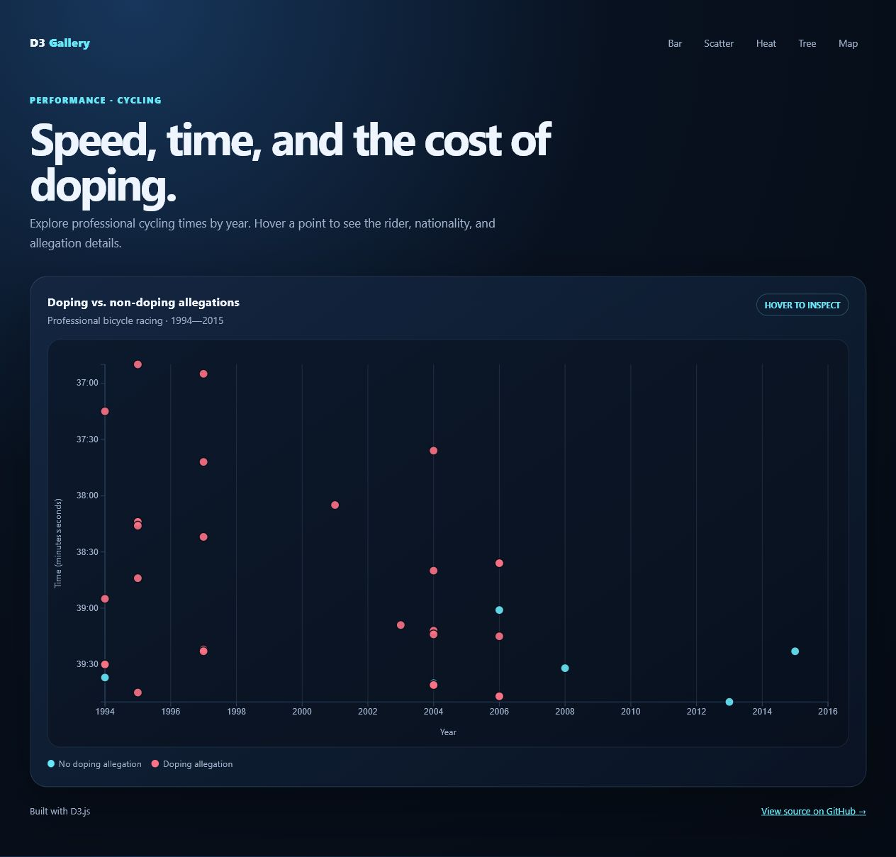
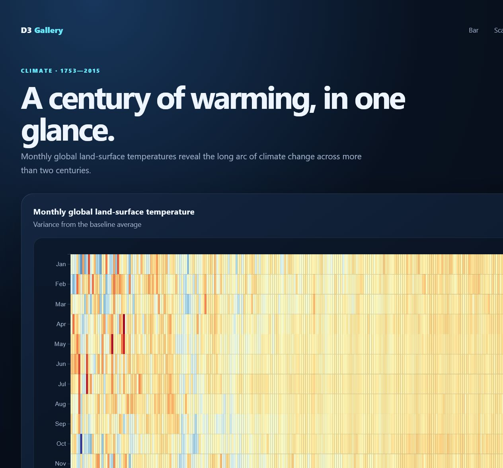
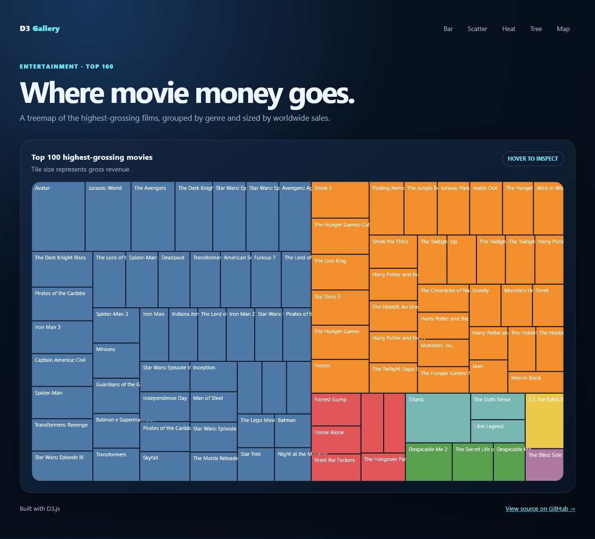

# D3 Gallery

<p align="center"><strong>Data, with a point of view.</strong><br>Five interactive D3.js visualizations in one focused portfolio.</p>

<p align="center"><a href="https://engrbugs.github.io/D3BarChart/">Open the live gallery →</a></p>

## Explore the gallery

| Visualization | What it explores | Live demo |
| --- | --- | --- |
| **Bar chart** | US GDP growth from 1950–2015 | [Open demo →](https://engrbugs.github.io/D3BarChart/bar-chart/) |
| **Scatter plot** | Cycling performance and doping allegations | [Open demo →](https://engrbugs.github.io/D3BarChart/scatter-plot/) |
| **Heat map** | Monthly global land-surface temperature | [Open demo →](https://engrbugs.github.io/D3BarChart/heat-map/) |
| **Tree map** | The top 100 highest-grossing movies | [Open demo →](https://engrbugs.github.io/D3BarChart/tree-map/) |
| **Choropleth map** | US education attainment by county | [Open demo →](https://engrbugs.github.io/D3BarChart/choropleth-map/) |

## Visual previews

Click any preview to open the live interactive chart.

<table>
  <tr>
    <td><a href="https://engrbugs.github.io/D3BarChart/bar-chart/"></a></td>
    <td><a href="https://engrbugs.github.io/D3BarChart/scatter-plot/"></a></td>
  </tr>
  <tr>
    <td><a href="https://engrbugs.github.io/D3BarChart/heat-map/"></a></td>
    <td><a href="https://engrbugs.github.io/D3BarChart/tree-map/"></a></td>
  </tr>
  <tr>
    <td colspan="2"><a href="https://engrbugs.github.io/D3BarChart/choropleth-map/"></a></td>
  </tr>
</table>

## Repository structure

```text
D3BarChart/
├── README.md
├── gallery.css
├── bar-chart/
├── scatter-plot/
├── heat-map/
├── tree-map/
└── choropleth-map/
```

Each visualization has its own responsive presentation, accessible title, hover details, and direct live-demo route.

## Built with

- [D3.js](https://d3js.org/)
- Semantic HTML and responsive CSS
- Public reference datasets from freeCodeCamp

If this gallery is useful or inspiring, consider giving it a ⭐ on GitHub.

<!-- touch: refresh repo activity -->

<!-- repo-activity-bump: 2026-08-04T19:08:39Z -->
